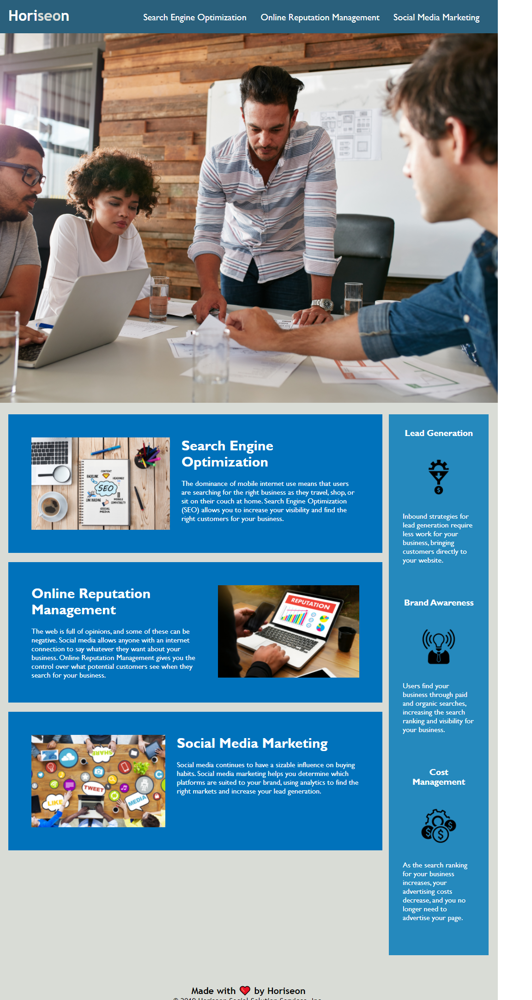

# 02-Marketing_Agency
## Refactoring existing code to meet a certain set of standards.

The refactoring project is based on some acceptance criterias as bellow:

GIVEN a webpage meets accessibility standards
WHEN I view the source code
THEN I find semantic HTML elements
WHEN I view the structure of the HTML elements
THEN I find that the elements follow a logical structure independent of styling and positioning
WHEN I view the icon and image elements
THEN I find accessible alt attributes
WHEN I view the heading attributes
THEN they fall in sequential order
WHEN I view the title element
THEN I find a concise, descriptive title

The orginal website has layout issue and bad user experience like the color is not accessible to users and infomation mixed up which is hard for user to read. I added alt attributes for image elements, changed title element, also reorganized the CSS file make it follow semantic structure. I also modified CSS code, organized the website layout to get better user experience. From this project I have deep understand about the HTML and CSS structures, and more proficient in using  CSS to format the layout of a webpage. 

The screenshot of final website as following:

The link is 
https://jing-liu-778.github.io/02-Marketing_Agency/